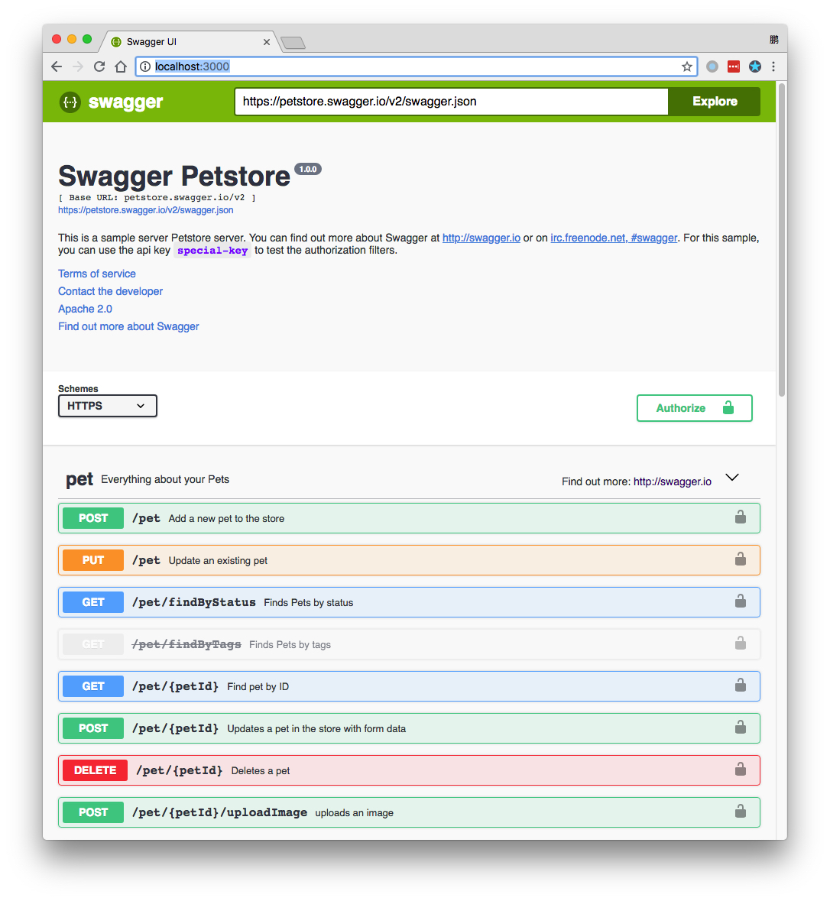
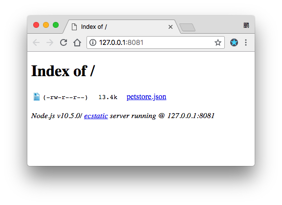

JavaScript Swagger UI Server Demo
=================================

在本地启动一个swagger-ui的服务器，可以用来查看swagger文件（支持json和yaml）

```
npm install
npm start
```



如果要查看一个网上的swagger文件，直接把它的网址填在顶部的输入框即可。

如果想查看本地的某个swagger文件，可以利用`http-server`在本地创建一个服务器，然后把swagger文件的地址填上去。

这里以`local-swagger/petstore.json`为例：

```
cd local-swagger
npm install -g http-server
http-server . -c-1 --cors -o
```

注意其中的`--cors`参数非常重要，它允许`petstore.json`文件被跨域使用，否则swagger-ui无法打开。



然后在swagger-ui处，填写petstore.json对应的url，此处为<http://127.0.0.1:8081/petstore.json>


